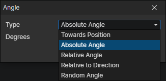

# Angle Getter

### Parameters

- Type
  - Towards Position：Calculate the angle of the actor towards the target position, enable parameter (Position)
  - Absolute Angle：Specify the angle, right = 0 degrees, clockwise rotation
  - Relative Angle：The relative angle to the actor's current angle, -180 degrees = opposite direction
  - Relative to Direction：The relative angle of the actor's current animation direction, affected by the number of animation directions
  - Random Angle：Randomly generated 0 ~ 360 degrees
