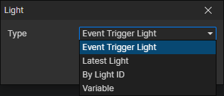

# Light Getter

### Parameters

- Type
  - Event Trigger Light：When a light event is triggered, get this light through it
  - Latest Light：Get the latest created light, which refreshes when the "Create Light" command is called
  - By Light ID：Get a preset light in the current scene, enable parameter (Data ID)
  - Variable：Get the light from the specified variable, enable parameter (Variable)
