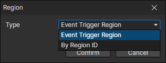

# Region Getter

### Parameters

- Type
  - Event Trigger Region：When a region event is triggered, get this region through it
  - By Region ID：Get a preset region in the current scene, enable parameter (Data ID)
