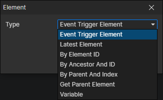

# Element Getter

### Parameters

- Type
  - Event Trigger Element：When an element event is triggered, get this element through it
  - Latest Element：Get the latest created element, which refreshes when the "Create Element" command is called
  - By Element ID：Get the latest created element with the specified ID, enable parameter (Data ID)
  - By Ancestor And ID：Get the first element with the specified ID among the descendant elements of the specified element, enable parameters (Element, Data ID)
  - By Parent And Index：Get a child element of the specified element, index 0 = first child element, index 1 = second child element, ......
  - Get Parent Element：Get the parent element of the specified variable element, enable parameter (Variable)
  - Variable：Get the element from the specified variable, enable parameter (Variable)
