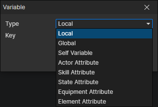

# Variable Getter

### Parameters

- Type
  - Local：A temporary variable stored in the event
  - Global：A preset variable that can be saved
  - Self Variable：A property specific to the preset object in the scene that can be saved
  - Actor Attribute：Customizable in the "Object Attribute" window
  - Skill Attribute：Customizable in the "Object Attribute" window
  - State Attribute：Customizable in the "Object Attribute" window
  - Equipment Attribute：Customizable in the "Object Attribute" window
  - Element Attribute：Customizable in the "Object Attribute" window, and the "object" type is available

:::tip

Global variables can be divided into the following categories：

- Normal：Variables are written to the archive when saving the game.
- Shared：Variables are saved when exiting the game and loaded when starting the game
- temporary：Variables will not be saved and will be reset with the game reset, but the "object" type is available.

:::

:::tip

Variable type description：

- Boolean：Two simple states can be written: true and false
  - Number：Supports integers and decimals, can be used to write multiple states, such as 0, 1, 2, 3... represent different stages of a quest
  - String：It can be used to write the name or to write the state, it is easier to understand by using text as the state, such as "open", "closed"
  - Object：The object can be an actor, skill, item, equipment, element, list, etc. Since the object cannot be saved, it can only be written to a temporary variable
- List：A container that can hold multiple data (boolean, number, string, object) in order, a list is also an object

:::
