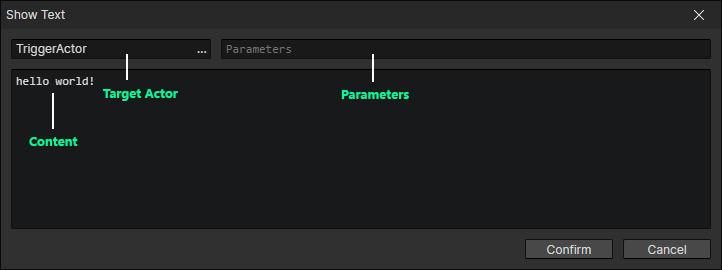
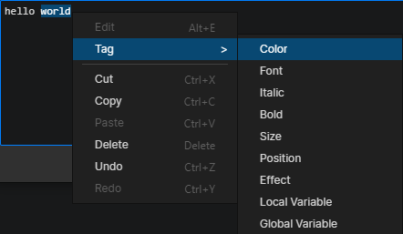
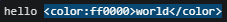
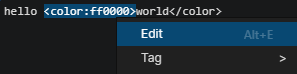

# Show Text

- Target Actor：The read actor will be set to "Actor Getter -> Target Actor"
- Parameters：Used to control the style of the interface
  - Format：ParamName: ParamValue, ... If there are multiple parameters separated by commas
  - Boolean Parameter Examples：( bool1, bool2: true, bool3: false ) equivalent to true if the parameter value is omitted
  - Number Parameter Example：( number: 233 )
  - String Parameter Example：( string: hello world )
- Content：It is usually a dialogue text

Executing this command will automatically call another preset event (modified in "Window -> Project Settings")  
Read the actor in the command via "Actor Getter -> Target Actor"  
Read parameters of the corresponding type by "Set Boolean", "Set Number" and "Set String" commands  
Read "Content" with the "Set String" command  
The purpose of this command is to call the preset event to handle these parameters, then create a dialog box, and load the dialog content

:::tip

Optional parameters for the default template project.

- mode: chat => Display bubble style
- name: xxxx => Use the specified actor name
- duration: 4000 => Specify the duration (ms) when in chat mode

The parameters can be combined with the "Change Actor Portrait" command to switch actor expressions, for example：

- face: smile, get this parameter in the "Show Text" event to change the actor's portrait and restore it at the end of the dialogue.

:::

### Insert Tag

- Insert rich text tags and variables via "context menu -> tag"

:::tip

After selecting the text, then insert the tag, you can insert the tag directly into the two ends of the selected text

Press the right mouse button on the tag position to open the context menu where you can edit this tag

:::

