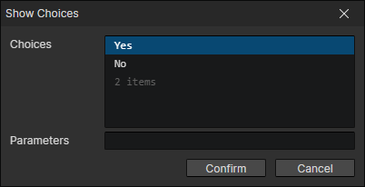

# Show Choices

- Choices：Set option branches, unlimited number
- Parameters：Used to control the style of the interface
  - Format：ParamName: ParamValue, ... If there are multiple parameters separated by commas
  - Boolean Parameter Examples：( bool1, bool2: true, bool3: false ) equivalent to true if the parameter value is omitted
  - Number Parameter Example：( number: 233 )
  - String Parameter Example：( string: hello world )

Executing this command will automatically call another preset event (modified in "Window -> Project Settings")  
Read choice contents with the "Set String" command  
Read parameters of the corresponding type by "Set Boolean", "Set Number" and "Set String" commands  
The purpose of this command is to call the preset event to handle these parameters, then create a choice box, and load the choices

:::tip

The default template project does not implement the parameters available for the "Show Choices" command

:::
