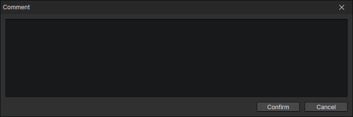
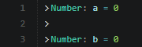

# Comment

A paragraph with no real effect, used to explain the role or purpose of the commands that follows.

:::tip

If these commands are crowded, you can insert a space comment to separate them

:::