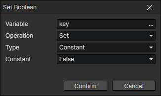

# Set Boolean

Can only be written if the variable is of type boolean or does not exist and the operand is of type boolean

- Variable：The target variable to be written
- Operation
  - Set：Set to the operand
  - Not：Set to the opposite value of the operand
  - And：Set to "True" when both the target variable and the operand are "True", otherwise set to "False"
  - Or：When at least one of the target variable and the operand is "True", set to "True", otherwise set to "False"
  - Xor：Set to "True" when the target variable is not the same as the operand, otherwise set to "False"
- Type
  - Constant：True or False
  - Variable：Using variable getter
  - List Item
    - Variable：Get a list object from the variable
    - Index：Read the Nth (0, 1, 2, ...) value in the list
  - Param Name：Parameters entered in the "Show Text" or "Show Choices" command
  - Script：Javascript return value