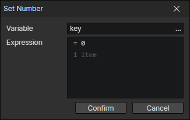
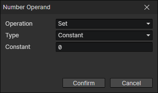

# Set Number

Can be used to set actor attributes, skill attributes, equipment attributes, and calculate damage, etc.  
Can only be written if the variable is of type number or does not exist and the operand is of type number

- Variable：The target variable to be written
- Expression：Multiple operands can be inserted

### Operand

- Operation
  - Set：Optional "set" operation for the first operand, setting the final result to the target variable
  - Add
  - Sub：Subtract
  - Mul：Multiply, high priority
  - Div：Divide, high priority
  - Mod：modulo, take the remainder of dividing A by B, high priority
  - (Add, Sub, Mul, Div, Mod)：high priority
- Type
  - Constant：Constant number
  - Variable：Using variable getter
  - Math
    - Round
      - Decimal Places：If 2 decimal places are kept, 1.2345 rounds to 1.23
    - Floor：Always round down and return the largest integer less than or equal to a given number
    - Ceil：Always round up and return the smaller integer greater than or equal to a given number
    - Sqrt：Return the square root of a number
    - Abs：Return the absolute value of a number
    - Cos：Return the cosine of a number in radians
    - Sin：Return the sine of a number in radians
    - Tan：Return the tangent of a number in radians
    - Random[0, 1)：Return a pseudo-random number that's greater than or equal to 0 and less than 1
    - Random Int：Return a random integer between two numbers
    - Distance：Calculate the distance between two positions
    - Horizontal Distance：Calculate the X-axis distance between two positions
    - Vertical Distance：Calculate the Y-axis distance between two positions
    - Relative Angle：Calculate the angle from position A to position B, right = 0 degrees, clockwise rotation
  - String
    - Get Length：Get the number of characters in the string, for example: "abcd" returns 4
    - Parse Number：Parse a string to a value, e.g. "12.34" returns 12.34
    - Get Index of Search String：Search for the position of the substring in the string, e.g. in "abcdefg", search for "abc" and the result is 0, search for "cdef" and the result is 2. Search for "h" and the result is -1, meaning it does not exist.
  - Object
    - Actor - X：Horizontal position of the actor in the scene
    - Actor - Y：Vertical position of the actor in the scene
    - Actor - Screen X：Convert the actor's scene X to screen X in pixels
    - Actor - Screen Y：Convert the actor's scene Y to screen Y in pixels
    - Actor - Angle
    - Actor - Direction Angle：The angle corresponding to the direction of the actor's animation (single direction is always 0, two directions may be 0/180, four directions may be 0/90/180/270)
    - Actor - Movement Speed
    - Actor - Collision Size
    - Actor - Collision Weight
    - Actor - Item Quantity
    - Actor - Equipment Quantity
    - Actor - Inventory Money
    - Actor - Inventory Used Space：Space occupied by items and equipments in the actor's inventory
    - Actor - Inventory Version：It is incremented when the actor's inventory adds or removes items or equipments
    - Actor - Skill Version：It is incremented when the actor adds or removes skills
    - Actor - State Version：It is incremented when the actor adds or removes states
    - Actor - Equipment Version：It is incremented when the actor equips or unequips
    - Actor - Shortcut Version：It is incremented when the actor's shortcut bar is changed
    - Actor - Anim Current Time
    - Actor - Anim Duration
    - Actor - Anim Progress：Anim Current Time / Anim Duration = Anim Progress
    - Actor - Cooldown Time：Get the current cooldown time by the specified key
    - Actor - Cooldown Duration：Get the cooldown duration by the specified key
    - Actor - Cooldown Progress：= Cooldown Time / Cooldown Duration
    - Skill - Cooldown Time
    - Skill - Cooldown Duration
    - Skill - Cooldown Progress：= Cooldown Time / Cooldown Duration
    - State - Current Time
    - State - Duration
    - State - Progress：= Current Time / Duration
    - Equipment - Order in Inventory
    - Item - Order in Inventory
    - Item - Quantity
    - Trigger - Speed
    - Trigger - Angle
    - List - Length：Number of items in the list
  - Element
    - Element - Number of Children
    - Transform - Anchor X
    - Transform - Anchor Y
    - Transform - X
    - Transform - Y
    - Transform - Width
    - Transform - Height
    - Transform - X2
    - Transform - Y2
    - Transform - Height2
    - Transform - Height2
    - Transform - Rotation
    - Transform - Scale X
    - Transform - Scale Y
    - Transform - Skew X
    - Transform - Skew Y
    - Transform - Opacity
    - Window - Visible Grid Columns
    - Window - Visible Grid Rows
    - Text - Text Width：The actual width of the rendered text
    - Text - Text Height：The actual height of the rendered text
    - Text Box - Number：Requires the text box element to be a number type
    - Dialog Box - Print End X
    - Dialog Box - Print End Y
  - List Item：
    - Variable：Get a list object from the variable
    - Index：Read the Nth (0, 1, 2, ...) value in the list
  - Param Name：Parameters entered in the "Show Text" or "Show Choices" command
  - Script：Javascript return value
  - Other
    - Event Trigger Button：Get the button code of the currently triggered "mouse event"
    - Event Trigger Wheel Delta Y：Get the DeltaY of the currently triggered "wheel event" (less than 0: slide up, greater than 0: slide down)
    - Mouse Screen X：Horizontal position of the mouse in the screen in pixels
    - Mouse Screen Y：Vertical position of the mouse in the screen in pixels
    - Mouse Scene X：Horizontal position of the mouse in the scene in tiles
    - Mouse Scene Y：Vertical position of the mouse in the scene in tiles
    - Start Position X：Set via "Scene Stage -> Context Menu -> Set Initial Position"
    - Start Position Y：Set via "Scene Stage -> Context Menu -> Set Initial Position"
    - Camera X：Horizontal position of the center of the camera
    - Camera Y：Vertical position of the center of the camera
    - Camera Zoom
    - Screen Width：The width of the game resolution
    - Screen Height：The height of the game resolution
    - Scene Width：The number of horizontal grids in the scene
    - Scene Height：The number of vertical grids in the scene
    - Play Time：The player's total play time, will be saved
    - Epalsed Time：The running time from starting the game to now, it will be cleared after exiting the game
    - Delta Time：The elapsed time from the end of the previous frame to the beginning of the current frame in milliseconds, may be 16.66 at 60FPS. If the game speed is 2, the delta time is scaled to 2 times, which is 33.33ms
    - Raw Delta Time：Delta time without scaling
    - Get Timestamp：Generate a number for recording the current date in this computer
    - Party Version：It is incremented when party members change
    - Number of Party Members
    - Number of Actors in the Scene：Get the number of actors in the specified team in the current scene

:::tip

If performing decimal operations, it is important to note that  
Because the possibilities of a decimal are infinite, and the finite memory capacity cannot hold infinite data, the decimals saved in the computer are approximations  
The following errors can occur  
0.3 - 0.1 = 0.1999999999999999998 instead of 0.2  
The above phenomenon may occur if there are multiple decimals involved in the operation  
You can correct the value by "Set Number command -> Math -> Round (keep decimal places)"

:::