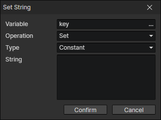

# Set String

Can be used to set actor attributes, skill attributes, equipment attributes, etc.  
Can only be written if the variable is of type string or does not exist and the operand is of type string

- Variable：The target variable to be written
- Operation
  - Set：Set to the operand
  - Add：Add the operand to the end
- Type
  - Constant：Constant string
  - Variable：Using variable getter
  - Template String：Variable tags can be inserted
  - String Method
    - Char：Get the character at the specified position from the string (the first character is at position 0)
    - Slice：Get the substring from the string at the specified position
    - Pad Start：Pad a number or string to a specified length, e.g. pad the number 1 with "0" to length 2, and return the string "01"
    - Replace：Replace the first "ab" in "abcdabcd" with "1" to return "1cdabcd"
    - Replace All：Replace all "ab" in "abcdabcd" with "1" to return "1cd1cd"
  - Attribute Key：Read the key of the specified attribute
  - Enumeration：Read the value of the specified enumeration
  - Object
    - Actor - Team ID
    - Actor - File ID
    - Actor - Anim Motion Name：Enumeration value of the motion
    - Skill - File ID
    - State - File ID
    - Equipment - File ID
    - Equipment - Slot：Enumeration value of the slot
    - Item - File ID
    - File - ID
  - Element
    - Text - Content
    - Text Box - Text
    - Dialog Box - Content
  - List Item
    - Variable：Get a list object from the variable
    - Index：Read the Nth (0, 1, 2, ...) value in the list
  - Param Name：Parameters entered in the "Show Text" or "Show Choices" command
  - Script：Javascript return value
  - Other
    - Event Trigger Key：Get the key code of the currently triggered "keyboard event"
    - Start Position - Scene ID：Set via "Scene Stage -> Context Menu -> Set Initial Position"
    - Show Text - Content：The text content can be read after calling the "Show Text" command
    - Show Choices - Content：The choice content can be read after calling the "Show Choices" command
    - Parse Timestamp：Parse the timestamp generated by "Set Number" command into a date string of the specified format
    - Screenshot(Base64)：Take a picture of the current game screen and convert it to Base64 string, which can be loaded into an image element by calling the "Load Image" command