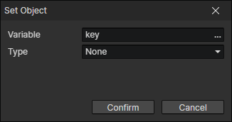

# Set Object

You can store an actor, skill, state, equipment, item, trigger, light, element into the object variable for later access  
Can only be written if the variable is of type object or does not exist and the operand is of type object

- Variable：The target variable to be written
- Type
  - None：Equivalent to deleting the variable
  - Actor：Actor getter
  - Skill：Skill getter
  - State：State getter
  - Equipment：Equipment getter
  - Item：item Getter
  - Trigger：Trigger getter
  - Light：Light getter
  - Equipment：Element getter
  - Variable：Variable getter
  - List Item
    - Variable：Get a list object from the variable
    - Index：Read the Nth (0, 1, 2, ...) value in the list