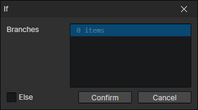
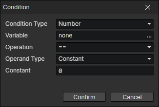

# If

- Branches：A branch can have multiple conditions, if the conditions are met, execute the commands of the branch, otherwise check the conditions of the next branch
- Else：If checked, when none of the branch conditions are sufficient, go to the "else" branch

### Condition

- Condition Type
  - Boolean
    - Variable：Variable Getter
    - Operation
      - Equal to (==)
      - Not Equal to (!=)
    - Operand Type
      - None：Does not exist
      - Constant
      - Variable
  - Number
    - Variable：Variable Getter
    - Operation
      - Equal to (==)
      - Not Equal to (!=)
      - Greater than or equal to (>=)
      - Less than or equal to (<=)
      - Greater than (>)
      - Less than (<)
    - Operand Type
      - None：Does not exist
      - Constant
      - Variable
  - String
    - Variable：Variable Getter
    - Operation
      - Equal to (==)
      - Not Equal to (!=)
      - Include
      - Exclude
    - Operand Target
      - None：Does not exist
      - Constant
      - Variable
      - Enumeration
  - Object
    - Variable：Variable Getter
    - Operation
      - Equal to (==)：Enable Parameter (Operand Type)
      - Not Equal to(!=)：Enable Parameter (Operand Type)
      - is Actor
      - is Skill
      - is State
      - is Equipment
      - is Item
      - is Trigger
      - is Light
      - is Element
    - Operand Type
      - None：Does not exist
      - Actor：Actor Getter
      - Skill：Skill Getter
      - State：State Getter
      - Equipment：Equipment Getter
      - Item：Item Getter
      - Trigger：Trigger Getter
      - Light：Light Getter
      - Element：Element Getter
      - Variable：Variable Getter
  - Actor
    - Actor：Actor Getter
    - Operation
      - Present and Active
      - Present：The actor is in the current scene
      - Absent：The actor is not in the current scene
      - Active：Default
      - Inactive：Change the activation status of an actor with the "Set Active" command
      - Has Targets：There is a target actor in the actor's target pool
      - Has No Targets：There is no target actors in the actor's target pool
      - In Screen：The actor is inside the visible area of the camera
      - Is Player Actor：The actor is set to "Player Actor"
      - Is Party Member
      - Has Skill
      - Has State
      - Has Items
      - Has Equipments
      - Has Skill Shortcut：The specified "shortcut key" corresponds to a skill
      - Has Item Shortcut：The specified "shortcut key" corresponds to an item
      - Equipped
      - Is a Teammate of Actor ...：Be in the same team as the specified actor
      - Is a Friend of Actor ...：The team relationship with the specified actor is friendly
      - Is an Enemy of Actor ...：The team relationship with the specified actor is hostile
      - Is a Member of Team ...：Is a member of the specified team
      - Is a Friend of Team ...：The relationship with the specified team is friendly
      - Is an Enemy of Team ...：The relationship with the specified team is hostile
  - Element
    - Element：Element Getter
    - Operation
      - Present：The element read from the element getter is valid
      - Absent：The element read from the element getter is invalid
      - Visible：The element is not hidden
      - Invisible：The element is hidden
      - Dialog Box - is Paused
      - Dialog Box - is Updating
      - Dialog Box - is Waiting
      - Dialog Box - is Complete
  - Keyboard
    - Key Code
    - State
      - Pressed
      - Released
  - Mouse
    - Button
      - Left Button
      - Middle Button
      - Right Button
      - Back Button
      - Forward Button
    - State
      - Pressed
      - Released
  - List
    - Variable：List Variable Getter
    - Operation
      - Include
      - Exclude
    - Variable
      - Read the operand from the variable
  - Other
    - Other
      - Mouse has entered the window
      - Mouse has left the window
      - Game is paused
      - Game is not paused