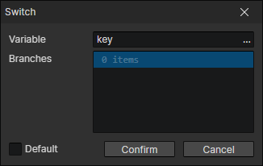
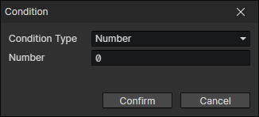

# Switch

Similar to the "If" command, if the variable is determined to be limited to a few specific values, using this command is clearer and easier to understand, and the performance is slightly improved.

- Variable：Target variable getter
- Branches：A branch can have multiple conditions, If one of the conditions is met, execute the commands of the branch, otherwise check the conditions of the next branch
- Default：If checked, when none of the branch conditions are sufficient, go to the "default" branch

### Condition

- Type
  - None：Does not exist
  - Boolean：Constant
  - Number：Constant
  - String：Constant
  - Attribute Key：String
  - Enumeration：String
  - Keyboard：Key code (String)
  - Mouse：Button code (Number)
  - Variable：Using Variable Getter