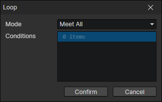

# Loop

A statement block that will be executed repeatedly when the condition is met. If the logic is flawed, it may enter an infinite loop, causing the game program to not respond.

- Mode
  - Meet All
  - Meet Any
- Conditions
  - Loop Condition：[Click to jump](if)