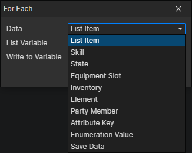

# For Each

Batch processing to reduce some repetitive work.

- Data
  - List Item：Read the value in the list one by one
  - Skill：Read all skills of the actor
  - State：Read all states of the actor
  - Equipment Slot：Read all equipments in the actor's slots
  - Inventory：Read all items and equipments in the actor's inventory
  - Element：Read all child elements of the specified element
  - Party Member：Read all members of the player party
  - Attribute Key：Read all attribute keys in the attribute group
  - Enumeration Value：Read all enumeration values in the enumeration group
  - Save Data：Read indexes (0, 1, 2, ...) and read local variables from save data
- Write to Variable：Write the read data to the specified variable

:::tip

"For each save data" is special in that it writes the archive index to the specified variable and reads the local variables written at the time of saving.  
Assume that the foo and bar variables are written when the game is saved, the two local variables foo and bar will be generated during traversal.

:::