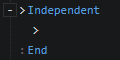

# Independent

Separate commands in the block for asynchronous execution

:::tip

The execution of events is designed to be bound to the host object  
Assume that the monster automatically executes an recurring AI event  
When the monster is set to inactive (dead) or deleted, the event will stop executing, thus avoiding an infinite loop  
When the player enters an area and triggers an event that calls the "Load Scene" command, the event's host "area" is also deleted with the current scene  
Then load the scene asynchronously, a short wait occurs, and the commands will not be executed after the wait as the host is destroyed.  
Putting the commands to an "Independent" block ensures that the event commands can be executed after the host is deleted

:::