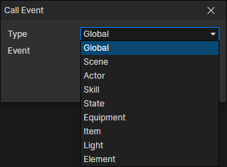

# Call Event

- Type
  - Global：Synchronous
  - Scene
  - Actor
  - Skill
  - State
  - Equipment
  - Item
  - Light
  - Element

:::tip

Synchronous Call：  
This is equivalent to embedding the command into this event, so the variables are shared, waiting for the called event to finish, and then moving on to the next command

Asynchronous Call：  
Calling an event does not affect the execution of the current event, and the local variables of the current event cannot be accessed directly in the called event

:::