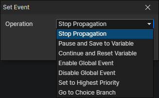

# Set Event

- Operation
  - Stop Propagation：Generally used in element events, when the user clicks on an element, it will first trigger the click event on the element, and then trigger the click event of the parent element, passing up the layer, and when this operation is performed, it will stop passing.
  - Pause and Save to Variable：Executing this action pauses the currently executing event and saves the event to an object variable.
  - Continue and Reset Variable：Continue the paused event and set the variable to a "none" value.
  - Enable Global Event：Automatic triggering of the event will return to normal.
  - Disable Global Event：Will no longer automatically trigger the event (Key Down, Mouse Down, etc.).
  - Set to Highest Priority：Once the event is set to the highest priority, it can be triggered even when the game is paused.
  - Go to Choice Branch：You can enter the specified choice branch after calling the "Show Choices" command.