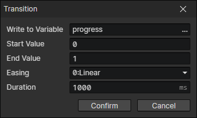

# Transition

- Write to Variable：Calculate the interpolation between the start value and the end value, and write it to this variable
- Start Value：Transition value generated by the first execution of the transition loop
- End Value：The transition value generated by the last execution of the transition loop
- Easing：Affect the interpolation calculation
- Duration：Transition time

:::tip

With this command, you can achieve the growth of numbers from small to large and the transition stretch animation of the progress bar.

:::
