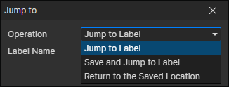

# Jump To

- Operation
  - Jump to Label：Jump to the specified label to continue execution
  - Save and Jump to Label：Save the current position and jump to the specified label
  - Return to the Saved Location：Jump to the last saved location

:::tip

AI events can be achieved through the "Jump To" command

:::