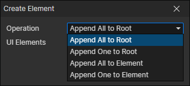

# Create Element

- Operation
  - Append All to Root：Create all elements in the UI file (except those that are disabled) and add them to the root container
  - Append One to Root：Create a specified element in the UI file (whether it is disabled or not) and add it to the root container
  - Append All to Element：Create all elements in the UI file (except those that are disabled) as children of the specified element
  - Append One to Element：Create a specified element in the UI file (whether it is disabled or not) as a child of the specified element