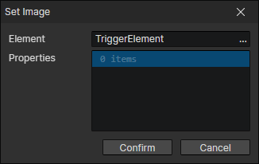
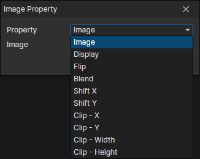

# Set Image

- Element：Image element getter
- Properties：Multiple image element properties can be set

### Image Property

- Property
  - Image
  - Display
    - Stretch
    - Tile
    - Clip
    - Slice
  - Flip
    - None
    - Horizontal
    - Vertical
    - Both
  - Blend
    - Normal
    - Additive
    - Subtract
    - Mask
  - Shift X
  - Shift Y
  - Clip - X
  - Clip - Y
  - Clip - Width
  - Clip - Height

- [Image property description](/docs/inspectors/ui/ui-image)