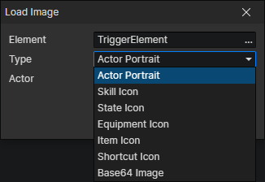

# Load Image

Load a special image into the image element.

- Element：Image element getter
- Type
  - Actor Portrait
  - Skill Icon
  - State Icon
  - Equipment Icon
  - Item Icon
  - Shortcut Icon
  - Base64 Image