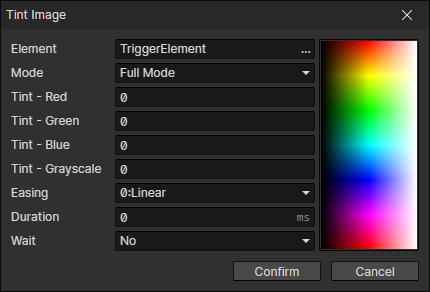

# Tint Image

- Element：Image element getter
- Mode
  - Full Mode：Enable parameters (Red, Green, Blue, Grayscale)
  - RGB Mode：Enable parameters (Red, Green, Blue)
  - Grayscale Mode：Enable parameter (Grayscale)
- Easing
- Duration
- Wait：Wait for the end of the transition and continue to execute the subsequent commands