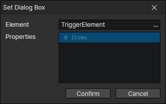
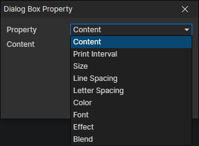

# Set Dialog Box

- Element：Dialog box element getter
- Properties：Multiple dialog box element properties can be set

### Dialog Box Property

- Property
  - Content：Insert rich text labels and variables via right-click menu
  - Print Interval
  - Size
  - Line Spacing
  - Letter Spacing
  - Color
  - Font
  - Effect
    - None
    - Shadow
    - Stroke
    - Outline
  - Blend
    - Normal
    - Additive
    - Subtract
- [Dialog box property description](/docs/inspectors/ui/ui-dialogbox)