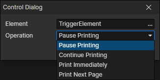

# Control Dialog Box

- Element：Dialog box element getter
- Operation
  - Pause Printing
  - Continue Printing
  - Print Immediately：Print text until the current page is filled, or until all text is printed.
  - Print Next Page：Erase the text on the current page and start printing the text of the next page.