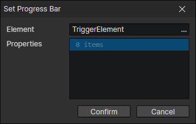
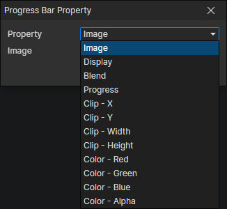

# Set Progress Bar

- Element：Progress bar element getter
- Properties：Multiple progress bar element properties can be set

### Progress Bar Property

- Property
  - Image
  - Display
  - Blend
  - Progress
  - Clip - X
  - Clip - Y
  - Clip - Width
  - Clip - Height
  - Color - Red
  - Color - Green
  - Color - Blue
  - Color - Alpha
- [Progress bar property description](/docs/inspectors/ui/ui-progressbar)