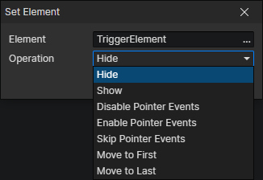

# Set Element

- Element：Element Getter
- Operation
  - Hide：When an element is hidden, it and its descendant elements (which actually still exist) will no longer be rendered.
  - Show：Unhide the element.
  - Disable Pointer Events：Disable automatic triggering of all pointer events (including mouse-down events) for this element and its descendant elements.
  - Enable Pointer Events：Restore automatic triggering of element pointer events.
  - Skip Pointer Events：Disable automatic triggering of all pointer events for this element, but not for its descendant elements.
  - Move to First：Moves the element to the first position in the list of its parent's child elements, (always obscured by other child elements, equivalent to being placed at the bottom).
  - Move to Last：Moves the element to the last position in the list of its parent's child elements, (always obscuring other children, equivalent to being placed on top).