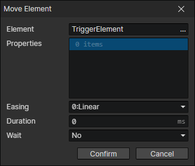
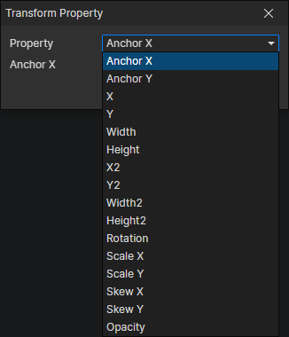

# Move Element

- Element：Element getter
- Properties：Multiple element properties can be set

### Element Property

- Property
  - Anchor X
  - Anchor Y
  - X
  - Y
  - Width
  - Height
  - X2：The ratio of the width of the parent element
  - Y2：The ratio of the height of the parent element
  - Width2：The ratio of the width of the parent element
  - Height2：The ratio of the height of the parent element
  - Rotation
  - Scale X
  - Scale Y
  - Skew X
  - Skew Y
  - Opacity
