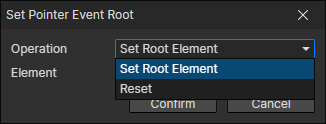

# Set Pointer Event Root

- Operation
  - Set Root Element：When set as the root element, only the pointer events of this element and its descendants will be triggered, preventing the pointer events of other elements
  - Reset：Reset to the default root container

:::tip

It is common to set the following events for a window

- Autorun：Set itself as the root element and block events of elements outside the window
- Destroy：Reset the root element

:::