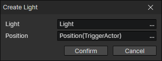

# Create Light

Create a preset light source at the specified location

- Light：Select a preset light source in the scene, only when you switch to the open scene, you can get the list of light sources from the current scene
- Position：Position getter