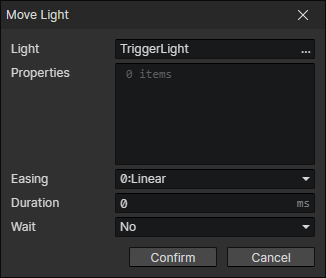
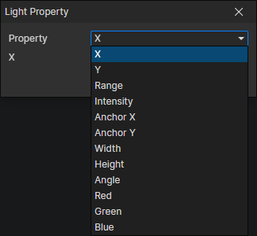

# Move Light

- Light：Light Getter
- Properties：Multiple light properties can be set

### Light Property

- Property
  - X
  - Y
  - Point Light - Range
  - Point Light - Intensity
  - Area Light - Anchor X
  - Area Light - Anchor Y
  - Area Light - Width
  - Area Light - Height
  - Area Light - Angle
  - Red
  - Green
  - Blue
- [Light property description](/docs/inspectors/scene/scene-light)