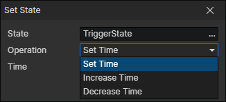

# Set State

Set the duration of the state. The newly created state has a duration of 60 seconds. At this point you need to read the custom duration attribute and write it. In this way, the state countdown will be automatic.

- State：State Getter
- Operation
  - Set Time
  - Increase Time
  - Decrease Time：When the time of the state is 0, it will be removed