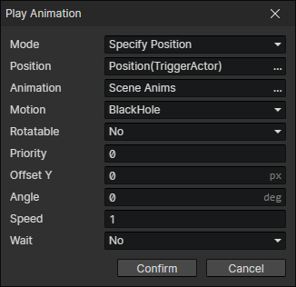

# Play Animation

- Mode
  - Specify Position：The animation is placed in a fixed position
  - Bind Actor：The animation always stays in the same position as the actor
- Animation：Animation File
- Motion：A motion of the current animation
- Rotatable：When on, the rotation of the animation is affected by "angle"
- Priority：Prioritize the animation when rendering, so that animations located below will always overlay those above.
  - Priority = -1 means that the sorting position is shifted up by one tile distance.
  - Priority = 1 means that the sorting position is shifted down by one tile distance.
- Offset Y：Vertical position offset of the animation
- Angle：The angle of the animation, which affects the "animation direction"
- Speed
- Wait：Continue executing the event command after the animation is finished

:::tip

If the animation is looping, it will never end.

:::