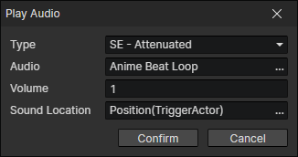

# Play Audio

- Type
  - BGM：Only one audio can be played at the same time
  - BGS：Only one audio can be played at the same time
  - CV：Only one audio can be played at the same time
  - SE：Multiple audio can be played at the same time
  - SE - Attenuation：Multiple audio can be played at the same time, often used for battle sound effects
    - Sound Location：The farther the camera center is from the sound position, the more the sound is attenuated, the relevant settings are modified in "Window -> Project Settings".

:::tip

SE - Attenuation：  
The actual volume depends on the distance from the center of the camera at the start of playback and does not change afterwards  
When the sound position is more than a certain distance from the camera, the sound effect will not be played

:::