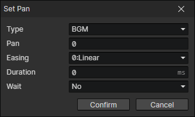

# Set Pan

- Type
  - BGM
  - BGS
  - CV
  - SE
- Pan：-1 ~ 1
  - 0：Balanced
  - -1：Left channel only
  - 1：Right channel only
- Easing
- Duration
- Wait：Wait for the end of the transition and continue to execute the subsequent commands
