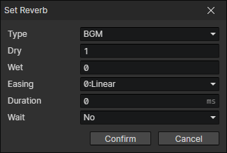

# Set Reverb

Some closed spaces (such as sewers, caves, halls) can be turned on for reverberation to increase the atmosphere.

- Type
  - BGM
  - BGS
  - CV
  - SE
- Dry：The gain of the dry part of the reverberation, the smaller it is, the farther it is from the sound source
- Wet：The gain of the wet part of the reverberation, simulating the sound reflection in a closed environment, the larger it is, the larger the closed space
- Easing
- Duration
- Wait：Wait for the end of the transition and continue to execute the subsequent commands
- Reverb - Dry：
- Reverb - Wet：