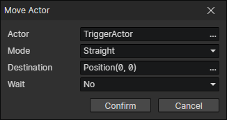

# Move Actor

- Actor：Actor Getter
- Mode
  - Stop：Stop actor movement, including following behavior
  - Keep：Keep moving towards an angle
  - Straight：Move in a straight line to the target location
  - Navigate：Auto pathfinding
  - Navigate - Bypass Actors：Navigate to the target location and bypass other actors
  - Teleport：Move immediately to the target location
- Wait：Wait for the actor to finish moving and execute the subsequent commands