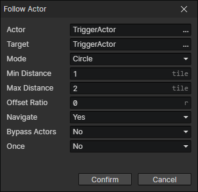

# Follow Actor

- Actor：Actor Getter
- Target：Actor Getter
- Mode
  - Circle：Actor A follows Actor B within a circle.
    - Min Distance：When the distance is less than the minimum distance, actor A will move away from actor B.
    - Max Distance：When the distance is greater than the maximum distance, actor A will approach actor B.
    - Offset Ratio：If there are multiple actors following the same actor and the following distance is the same, you can set different offset ratios separately to avoid overlap.
  - Rectangle：Actor A follows Actor B within a rectangle.
    - Min Distance：When the horizontal distance is less than the minimum distance, actor A will move away from actor B.
    - Max Distance：When the horizontal distance is greater than the maximum distance, actor A will approach actor B.
    - Vert Distance：When the Y-axis distance between actors is greater than the "vertical distance", actor A will approach actor B on the Y-axis.
  - Navigate：Repeat pathfinding when following the actor, enable parameters (Bypass Actor)
  - Bypass Actors：Bypass other actors when pathfinding
  - Once：The actor stops following after reaching his destination

:::tip

Circle following mode

- It can be used to follow teammates, or to follow enemies, to get close to the target and cast skills, or to keep a distance from enemies by increasing minimum following distance.

Rectangle following mode

- When the attack direction is only left and right, it is suitable to use this following mode.

:::