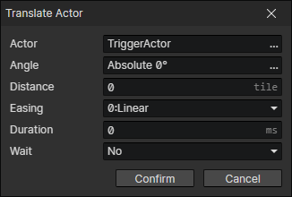

# Translate Actor

Displace the actor at an angle for a distance, which can be used for displacement skills, knockback effects, attraction effects, etc.

- Actor：Actor Getter
- Angle：Displacement angle
- Distance：Displacement distance
- Easing
- Duration
- Wait：Wait for the end of the transition and continue to execute the subsequent commands