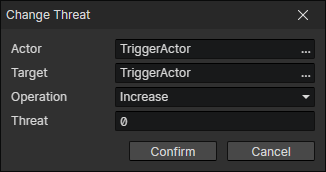

# Change Threat

- Actor：Actor Getter
- Target：Actor Getter
- Operation
  - Increase：Increase the threat value to the target actor, while automatically adding the target actor to the target pool
  - Decrease：Decrease the threat value to the target actor
- Threat：You can get the "Max Threat" actor with the "Get Target" command

:::tip

You can increase the threat value of the actor to the target in proportion to the damage.

:::