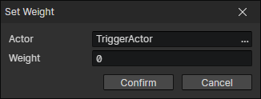

# Set Weight

- Actor：Actor Getter
- Weight：0 ~ 8
  - When weight = 0, the actor's collision is ignored
  - When the weight of actor A : the weight of actor B = 1 : 1, the movement speed of A pushing B is 50%.
  - When the weight of actor A : the weight of actor B = 1 : 2, the movement speed of A pushing B is 0%.
  - When the weight of actor A : the weight of actor B = 2 : 1, the movement speed of A pushing B is 100%, there is no resistance at all.