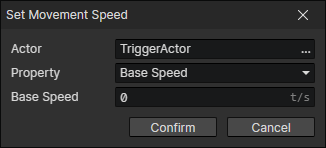

# Set Movement Speed

Base Speed \* Speed Factor \* Speed Factor (Temp) = Final movement speed

- Actor：Actor Getter
- Property
  - Base Speed：The number of tiles the actor moves per second.
  - Speed Factor：Usually used to write the actor movement speed factor.
  - Speed Factor (Temp)：Usually used in situations where the actor's movement speed is affected while the skill is being cast, such as when movement speed is halved on an attack.