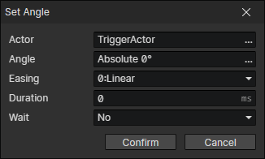

# Set Angle

Change the angle of the actor and change the direction of the animation at the same time.

- Actor：Actor getter
- Angle
- Easing
- Duration
- Wait：Wait for the end of the transition and continue to execute the subsequent commands