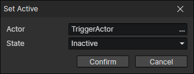

# Set Active

- Actor：Actor getter
- State
  - Active：Return to normal (resurrect the actor)
  - Inactive：Usually set to inactive on the actor's death, when the actor's related events will stop executing