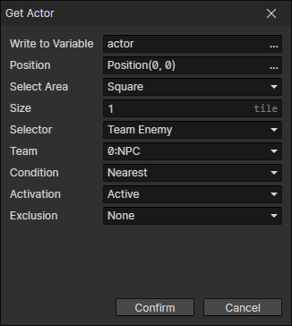

# Get Actor

Get an actor from the scene and write it to a variable

- Write to Variable：Write the actor to this variable
- Position：A location in the scene
- Select Area
  - Square：Get an actor inside a square centered at the specified position.
    - Size：Square side length (in tiles)
  - Circle：Get an actor inside a circle centered at the specified position.
    - Radius：Circle radius (in tiles)
- Selector
  - Team Enemy：A hostile actor of the specified team, enable parameter (Team)
  - Team Friend：A friendly actor of the specified team, enable parameter (Team)
  - Team Member：A member of the specified team, enable parameter (Team)
  - Any
- Team
- Condition
  - Nearest：The actor closest to the specified location
  - Farthest：The actor furthest away from the specified location
  - Min Attribute Value：The actor with the minimum value of the specified attribute, enable parameter (Attribute).
  - Max Attribute Value：The actor with the maximum value of the specified attribute, enable parameter (Attribute).
  - Min Attribute Ratio：The actor with the minimum ratio of two attribute values, enabled parameters (Attribute, Attribute 2)
  - Max Attribute Ratio：The actor with the maximum ratio of two attribute values, enabled parameters (Attribute, Attribute 2)
  - Random：Select a random actor
- Activation
  - Active：The actor must be active
  - Inactive：The actor must be inactive
  - Either
- Exclusion
  - None
  - Exclude Actor：The target cannot be the specified actor
  - Exclude Team：The target cannot be a member of the specified team