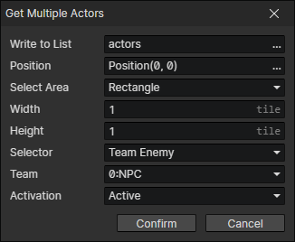

# Get Multiple Actors

Get multiple actors from the scene and write them as a list into a variable

- Write to List：Write the actors to this variable
- Position：A location in the scene
- Select Area
  - Rectangle：Get actors inside a rectangle centered at the specified position.
    - Width：Rectangle width (in tiles)
    - Height：Rectangle height (in tiles)
  - Circle：Get actors inside a circle centered at the specified position.
    - Radius：Circle radius (in tiles)
- Selector
  - Team Enemy：Hostile actors of the specified team, enable parameter (Team)
  - Team Friend：Friendly actors of the specified team, enable parameter (Team)
  - Team Member：Members of the specified team, enable parameter (Team)
  - Any
- Team
- Activation
  - Active：The actor must be active
  - Inactive：The actor must be inactive
  - Either