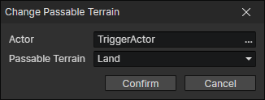

# Change Passable Terrain

Change the passable terrain of an actor

- Actor：Actor Getter
- Passable Terrain
  - Land：The actor can move in the land area, can not enter the water and wall area
  - Water：The actor can move in the water area, can not enter the land and wall area
  - Unrestricted：The actor can move in any terrain area

:::tip

Switch to "water" when you take the boat, change to "land" when you go ashore, and set to "unrestricted" when you take the airship.

:::