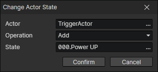

# Change Actor State

- Actor：Actor getter
- Operation
  - Add：Create a state and add it to the actor (if the same state already exists, remove it first)
  - Remove：Remove a state
  - Remove Instance：Read a state from the state getter and remove it from the actor